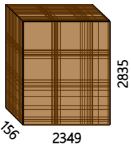

# 🛰️ EO-Based Drought Monitoring and Space-Time Cube Workflow

## 📍 Study Area
**Country**: Senegal  
**Administrative Unit**: ADM_2 level (departments)  
**Period**: 2010–2022  

This documentation outlines the workflow in three major stages:

---

## ✅ Step 1: Create Grids for Space-Time Cube Processing

We divide Senegal into **6 equal rectangular grid cells**.

### Tools:
- QGIS for grid generation
- Exported as GeoJSON or Shapefile

📸 **Insert Screenshot**: Senegal overlaid with 6 equal grids

---

## ✅ Step 2: Build Space-Time Data Cube Using Microsoft Planetary Computer + ODC

📌 **Purpose**: Use **Landsat data** to create a virtual cube that stacks multispectral imagery over time and space.

### Tools:

* **Python**
* **STAC API** (Planetary Computer)
* **ODC (Open Data Cube)**

### Steps:

1. **Query STAC for Landsat 5, 7, 8 data** for 2010–2022
2. **Apply cloud masking**
3. **Select Bands** (e.g., Red, NIR, SWIR, Thermal)
4. **Create time-indexed xarray cube**

5. **Process each of the 6 grids independently** for scalability
6. **Export indices** like NDVI, LST, and more

### Example Code Snippet (Python):

```python
from odc.stac import load
from pystac_client import Client

catalog = Client.open("https://planetarycomputer.microsoft.com/api/stac/v1")

search = catalog.search(
    collections=["landsat-c2-l2"],
    bbox=grid_bbox,
    datetime="2010-01-01/2022-12-31",
    query={"eo:cloud_cover": {"lt": 30}}
)

items = list(search.get_items())
ds = load(items, bands=["red", "nir08", "qa_pixel"], crs="EPSG:32628", resolution=30)
```

📸 **Insert Screenshot**: Cube preview with time and spatial dimensions

---

## ✅ Step 3: Extract ADM_2 Level Data Using Google Earth Engine

📌 **Purpose**: Generate aggregated monthly values of EO-based indices at **ADM_2 level**.

### Key Indices:

* **NDVI** (vegetation health)
* **Precipitation** (CHIRPS)
* **Temperature** (TerraClimate or ERA5) OR Surface Temperature
* **SPI** (3-, 6-, 12-month drought index)

### Tools:

* Google Earth Engine
* FAO GAUL/HDX ADM\_2 boundary shapefile

### Example Workflow (NDVI):

```javascript
var adm2 = ee.FeatureCollection("users/YOUR_USERNAME/senegal_adm2");

var ndvi = ee.ImageCollection('MODIS/061/MOD13Q1')
  .filterDate('2010-01-01', '2022-12-31')
  .select('NDVI')
  .map(function(img) {
    return img.multiply(0.0001).copyProperties(img, ['system:time_start']);
  });

var monthlyStats = ee.ImageCollection(ee.List.sequence(0, 155).map(function(m) {
  var start = ee.Date('2010-01-01').advance(m, 'month');
  var end = start.advance(1, 'month');
  var median = ndvi.filterDate(start, end).median()
    .set('system:time_start', start.millis());
  return median;
}));

var stats = monthlyStats.map(function(img) {
  return img.reduceRegions({
    collection: adm2,
    reducer: ee.Reducer.mean(),
    scale: 250
  }).map(function(f) {
    return f.set('date', img.date().format('YYYY-MM-dd'));
  });
}).flatten();
```

### Output:

* **CSV exports**: Monthly NDVI/Precipitation/Temperature/SPI per ADM\_2 unit
* **TIFF exports**: Raster maps for visualization

📸 **Insert Screenshot**: ADM_2 time series chart from GEE

---

### Processing Monthly Adm_2 Data

* **NDVI**

* We are going to use R studio first to change the data into wider format
* Then, we will combine the data with geometry
* Later, using tmaps package panel maps for the data of each regional department


Now, when you have These layers fo
